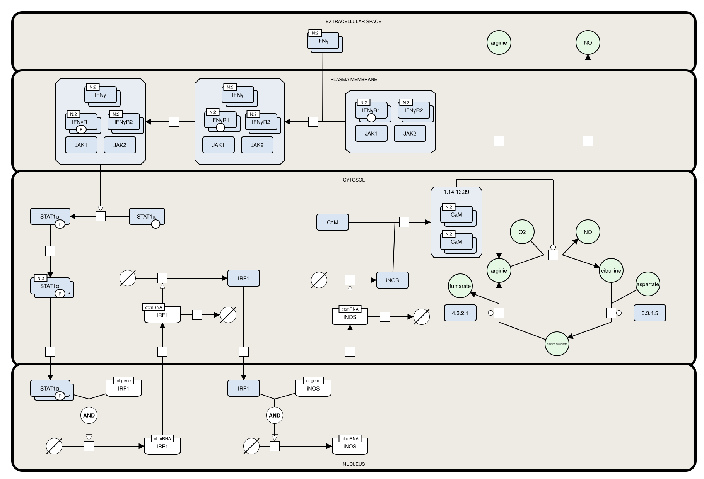
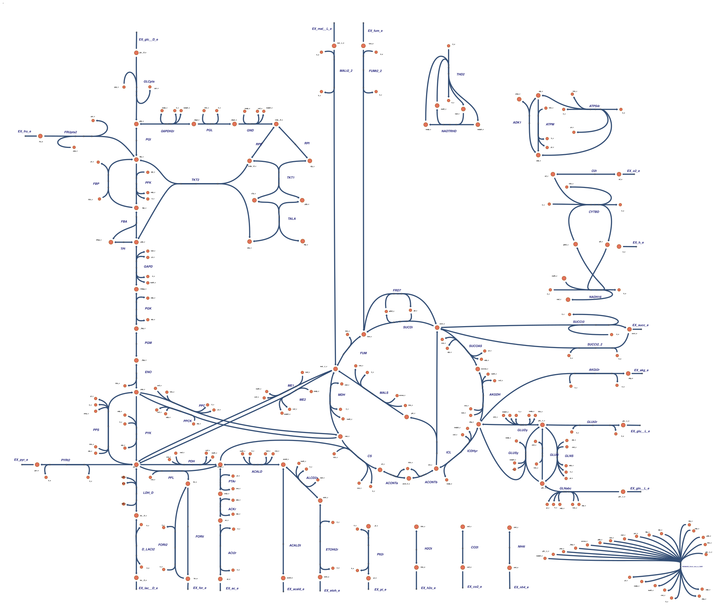
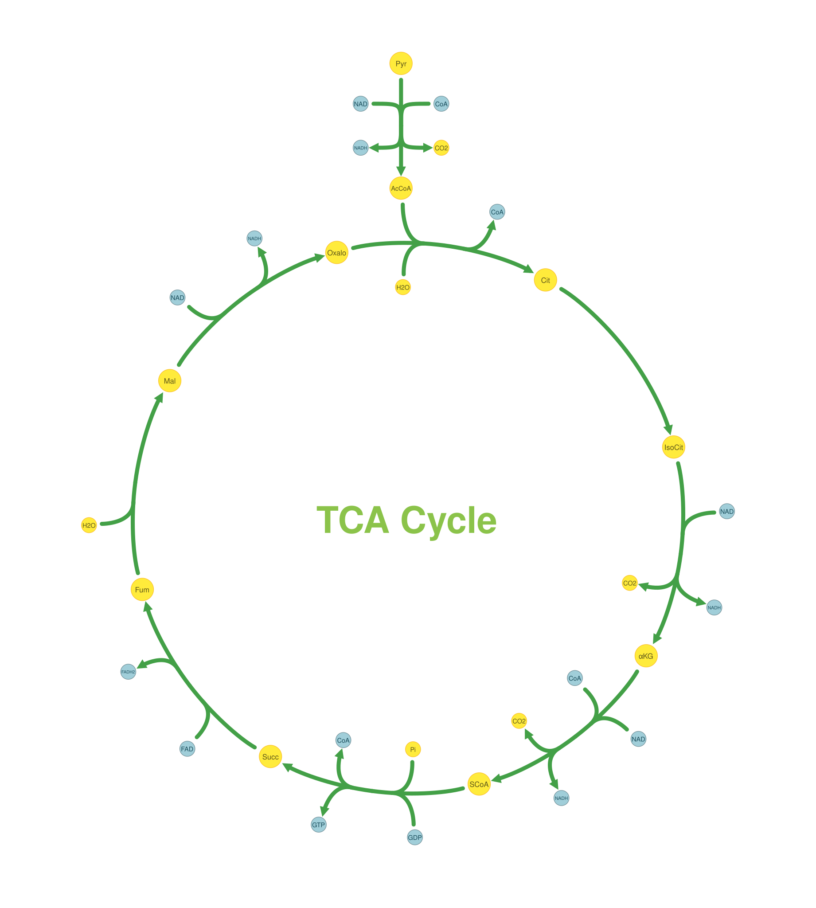
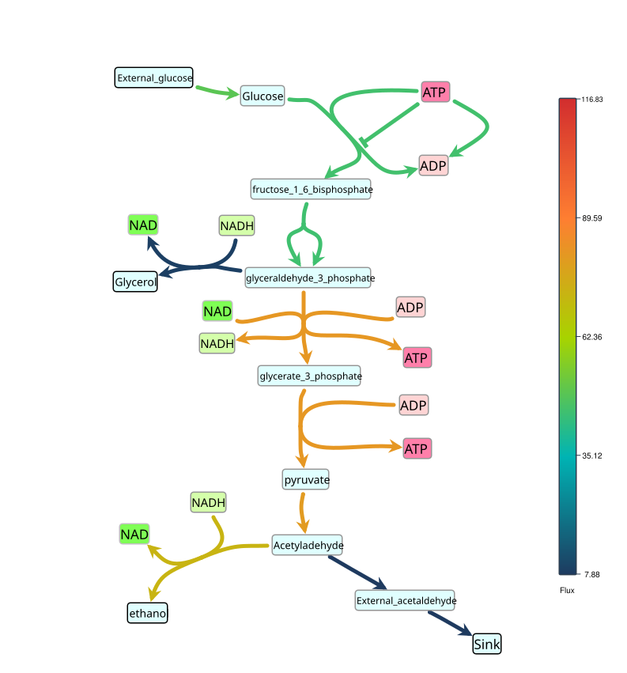

.. _gallery:

=======
Gallery
=======

Here we showcase some of the principal visualization capabilities of **SBMLNetwork**:
SBGN-style rendering, style template application, reaction alignment & layout
refinement, and simulation data overlays.

.. note::

   All visualization data (Layout + Render) are embedded directly
   inside the distributed SBML files and the link to those files is provided for each example.

Contents
--------

.. contents::
   :local:
   :backlinks: none
   :depth: 2

SBGN-Compliant Network
----------------------

   **SBGN-Compliant iNOS Pathway.**
   Rendered with SBGN-like glyphs: multi-compartment support, reaction centers,
   multi-segment curves, empty species, multiple labels, and customized arrowheads.

**Feature focus:** Standards-based reproduction of an SBGN map within SBML Layout/Render.

**Resources:** :download:`SBML file <https://github.com/sys-bio/SBMLNetwork/tree/develop/examples/paper/figure_2_sbgn_compliant/figure_2_sbgn_compliant.xml>` | :download:`Source script <https://github.com/sys-bio/SBMLNetwork/tree/develop/examples/paper/figure_2_sbgn_compliant>`

Escher-Style Template Application
---------------------------------

   **Escher Style on the E. coli Core Model.**
   An SBML model (with Layout) styled using an Escher-inspired template via
   SBMLNetwork’s Render utilities.

**Feature focus:** Applying a predefined style template across an entire network.

**Resources:** :download:`SBML file <https://github.com/sys-bio/SBMLNetwork/blob/develop/examples/paper/figure_3_visual_styling/figure_3_visual_styling.xml>` | :download:`Source script <https://github.com/sys-bio/SBMLNetwork/blob/develop/examples/paper/figure_3_visual_styling>`

Reaction Alignment and Layout Refinement
----------------------------------------

   **Reaction Alignment in the TCA Cycle.**
   Core TCA reactions arranged on a circular arc with a vertically aligned upstream
   step; alias species reduce edge crossings. Color encodings differentiate
   metabolite classes.

**Feature focus:** High-level geometric alignment (circular + vertical) for pathway logic.

**Resources:** :download:`SBML file <https://github.com/sys-bio/SBMLNetwork/blob/develop/examples/paper/figure_4_alignment/figure_4_alignment.xml>` | :download:`Source script <https://github.com/sys-bio/SBMLNetwork/blob/develop/examples/paper/figure_4_alignment>`

Simulation Data Overlays (Flux Encoding)
----------------------------------------

   **Reaction Flux Gradient on Glycolysis Pathway.**
   Reaction fluxes at a selected simulation time point encoded as a continuous
   color gradient on reaction curves (vivid → high flux; muted → low).

**Feature focus:** Mapping simulation output (fluxes) to visual attributes (color; also
supports thickness, node size, etc.).

**Resources:** :download:`SBML file <https://github.com/sys-bio/SBMLNetwork/blob/develop/examples/paper/figure_5_data_integration/figure_5_data_integration.xml>` | :download:`Source script <https://github.com/sys-bio/SBMLNetwork/tree/develop/examples/paper/figure_5_data_integration>`